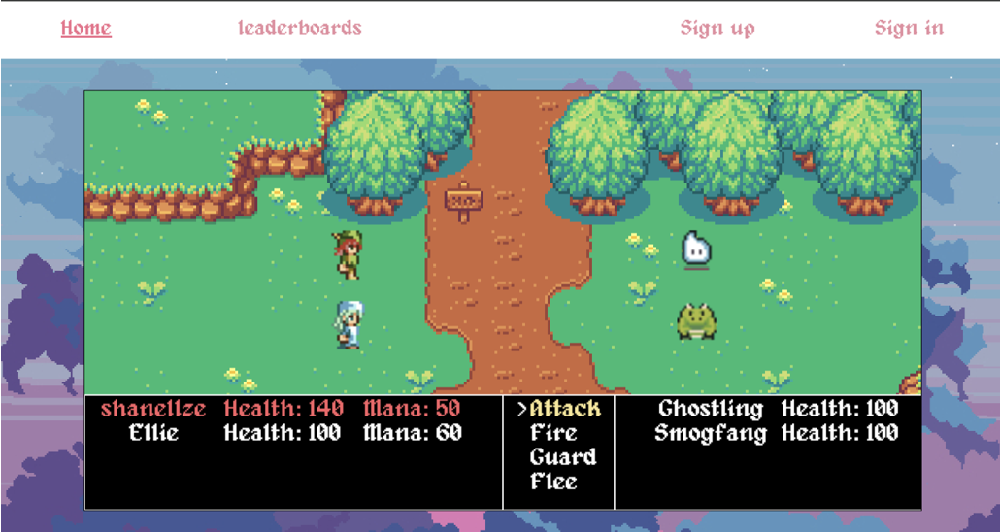

# Mystic Travellers

A browser-based RPG-style game built with HTML, CSS, and JavaScript.  
Includes account registration/sign-in (stored locally in the browser), a playable canvas game screen, and a leaderboard page.

## Tech Stack
- **HTML5** – Page structure and canvas rendering
- **CSS3** – Styling and layout
- **JavaScript (ES6+)** – Game logic, interactivity, and state management
- **Canvas API** – Game rendering and animations
- **Browser Storage**
  - `localStorage` for user accounts and saved scores
  - `sessionStorage` for active user sessions

No external frameworks or libraries were used.

## Approach
The project was built using a modular and structured approach:

- The application is split into multiple HTML pages (home/game, sign-in, sign-up, leaderboard).
- JavaScript ES modules are used to separate concerns such as:
  - Game logic
  - Player and enemy behavior
  - Authentication and registration handling
- The game logic is managed through a turn-based system where players can attack, use magic, guard, or flee.
- User data and leaderboard scores are stored locally in the browser, allowing the project to function without a backend.
- The UI was designed to be simple and readable while focusing on gameplay functionality.

This approach keeps the project lightweight, easy to understand.

## How to Run
### Option 1: Open locally
1. Download/clone the repo
2. Open `index.html` in your browser

> Note: Some browsers restrict ES module loading when opened as a local file.
> If the game doesn’t load, use the local server option below.

### Option 2: Run a local server (recommended)
If you have VS Code:
1. Install the **Live Server** extension
2. Right-click `index.html` → **Open with Live Server**

## References
- [Pokémon JavaScript Game Tutorial with HTML Canvas](https://www.youtube.com/watch?v=yP5DKzriqXA/)